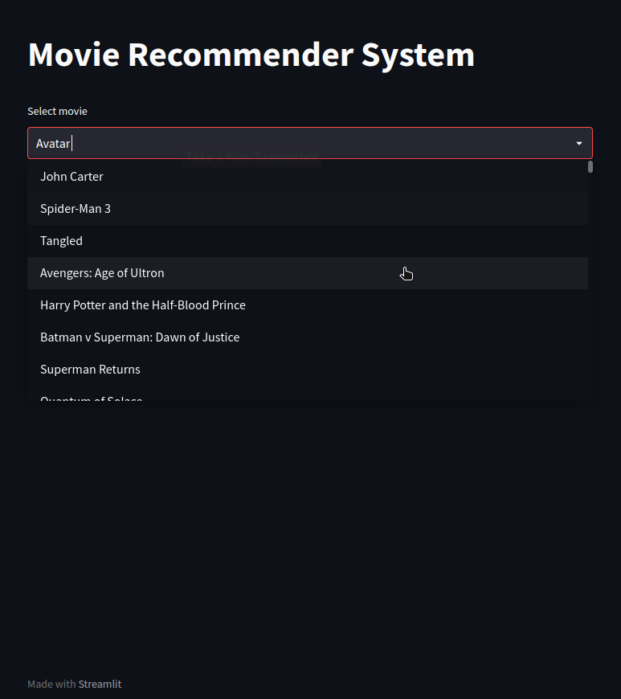
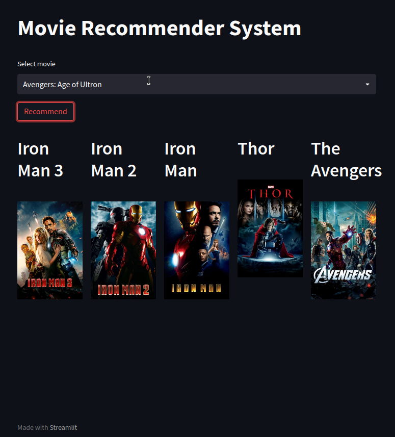

# Movie Recommendation System

A content based movie recommender system using cosine similarity

# Dataset
TMDB 5000 movies dataset on kaggle

# Demo
Site: https://recmod.herokuapp.com/
Github Repository: https://github.com/CK-ctrl/recsys.git

# Walk-through

1. Interface

2. Movie Selection

3. Recommend

4. Results

5. More Examples

